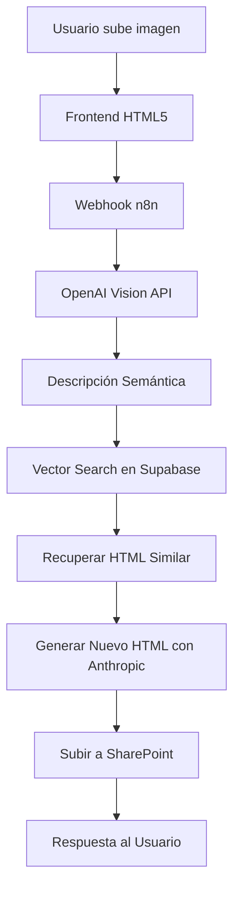
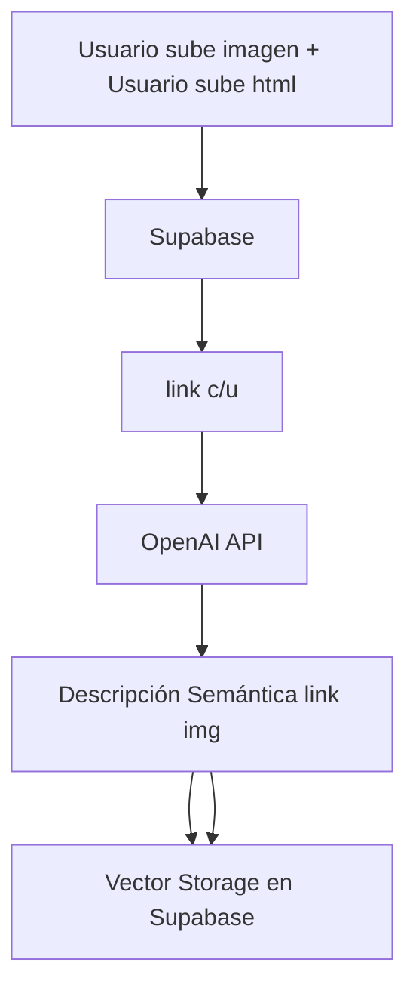

# 🚀 RAG HTML GENERE MAILINGS - Sistema de Automatización con n8n y IA

## 📋 **Descripción del Proyecto**

Sistema de automatización inteligente que utiliza **Retrieval-Augmented Generation (RAG)** para generar código HTML profesional a partir de imágenes de email marketing. El proyecto combina el poder de **n8n**, **OpenAI Vision**, **Anthropic - Clude**, **Supabase Vector Store** y **embeddings semánticos** para crear un flujo de trabajo completamente automatizado que analiza, aprende y genera HTML basándose en patrones visuales similares.

## 🎯 **Objetivo Principal**

Automatizar la generación de código HTML para campañas de email marketing mediante:
- Análisis visual inteligente de imágenes con OpenAI Vision API
- Búsqueda semántica en base de conocimiento vectorial
- Generación contextualizada de HTML basada en ejemplos similares
- Integración con SharePoint para almacenamiento empresarial

## 🏗️ **Arquitecturas**

### Arquitectura del sistema


Flujo de trabajo aqui (...)

### Arquitectura del rag


Flujo de trabajo aqui (...)


## 🛠️ Tecnologías Utilizadas

| Componente | Tecnología | Versión/Modelo |
|------------|------------|----------------|
| Orquestación | n8n | Latest |
| BD Vectorial | Supabase PostgreSQL | pgvector |
| Análisis de Imágenes | OpenAI Vision API | GPT-4o |
| Embeddings | OpenAI | text-embedding-3-large |
| Codigo HTML | Antrhopic | Claude Opus 4.1 |
| Reranking | Cohere API | Latest |
| Almacenamiento | SharePoint | Microsoft 365 |
| Frontend | HTML5/CSS3/JavaScript | Vanilla |


## 📁 **Estructura del Proyecto**

```
rag-html-generator/
├── workflows/
│   ├── RAG_v2.json           # Flujo de construcción del vector store
│   └── html_3.json           # Flujo principal de generación HTML
├── frontend/
│   └── index_2.html          # Interfaz de usuario
├── docs/
│   └── README.md             # Documentación
└── examples/
    └── email_templates/      # Ejemplos de HTML almacenados
```


## 🔄 **FLUJOS DE TRABAJO**

### 1️⃣ **RAG_v2.json - Construcción del Vector Store**

Este flujo es el corazón del sistema RAG y se ejecuta para construir la base de conocimiento:

#### **Paso a Paso:**

1. **Trigger Manual** (`When`)
   - Inicia el proceso de indexación de ejemplos

2. **Preparar Datos URL** (`Preparar_Datos_url`)
   - Carga 10 ejemplos de emails con sus URLs de Supabase
   - Estructura: `example_id`, `screenshot_url`, `html_url`, `tipo_email`

3. **Estructurar Datos Iniciales** (`estructurar_datos_iniciales`)
   - Define el prompt de análisis con 13 criterios semánticos:
     - Estructura HTML observada
     - Identidad única del email
     - Elementos distintivos
     - Contexto diferenciador

4. **Analizar Imagen** (`Analizar Imagen`)
   - Llamada a OpenAI Vision API (GPT-4o)
   - Genera descripción semántica profunda de cada email
   - Temperatura: 0.3 para consistencia

5. **Estructurar Datos Finales** (`Estructurar_datos_finales`)
   - Combina: `example_id`, `html_url`, `image_url`, descripción
   - Prepara metadata para trazabilidad

6. **Embeddings y Vector Store** 
   - **Embeddings OpenAI**: Modelo `text-embedding-3-large` (1536 dimensiones)
   - **Supabase Vector Store**: Almacena vectores con metadata
   - Tabla: `documents` con función de búsqueda `match_documents`

### 2️⃣ **html_3.json - Generación de HTML desde Imágenes**

Flujo principal que procesa las solicitudes del usuario:

#### **Paso a Paso:**

1. **Webhook Endpoint** (`Webhook`)
   - Path: `/obtener_imagen`
   - Método: POST
   - CORS habilitado
   - Recibe imagen en base64

2. **Procesar Imagen** (`procesar imagen`)
   - Valida y limpia datos binarios
   - Convierte a base64 limpio
   - Maneja tipos MIME correctamente

3. **Generar Descripción** (`generar_descripcion`)
   - Analiza la imagen con OpenAI Vision
   - Extrae características visuales y semánticas

4. **Búsqueda Vectorial** (`Supabase Vector Store`)
   - Modo: `load` para búsqueda semántica
   - Top-K: 2 resultados más similares
   - Usa Reranker de Cohere para optimizar resultados

5. **Descargar HTML de Referencia** (`Descargar_HTML`)
   - Obtiene el HTML del ejemplo más similar
   - Usa como base para la generación

6. **Preparar Prompt Final** (`Preparar prompt final`)
   - Combina:
     - HTML de referencia
     - Descripción de la nueva imagen
     - Instrucciones de adaptación

7. **Generar Nuevo HTML** (`Analyze image`)
   - OpenAI GPT-4o genera HTML adaptado
   - Mantiene estructura pero personaliza contenido

8. **Integración SharePoint**
   - **Configurar Credenciales**: Setup de autenticación
   - **Autenticar SharePoint**: Obtiene token de acceso
   - **Obtener Info Site**: Metadata del sitio
   - **Subir HTML**: Guarda el archivo generado

9. **Responder al Usuario** (`Respond`)
   - Devuelve HTML generado
   - Headers CORS configurados
   - Código 200 con JSON response

### 3️⃣ **index_2.html - Interfaz de Usuario**

Frontend moderno y responsivo con las siguientes características:

#### **Funcionalidades:**
- 📤 **Carga de Imágenes**: Drag & drop o selección manual
- 🖼️ **Preview**: Visualización previa de la imagen
- 📊 **Información del Archivo**: Tamaño, tipo, nombre
- 🔄 **Indicador de Proceso**: Estados en tiempo real
- 📋 **Visor de Código**: Syntax highlighting del HTML generado
- 💾 **Descarga**: Botón para guardar el HTML
- 📱 **Diseño Responsivo**: Adaptable a todos los dispositivos

#### **Validaciones:**
- Tipos de archivo: PNG, JPG, JPEG
- Tamaño máximo: 5MB
- Verificación de conexión con webhook


## 📊 Características Clave

### 🎨 Análisis Semántico Profundo
- 13 criterios de análisis por imagen
- Identificación de patrones visuales
- Extracción de elementos distintivos
- Comprensión del contexto empresarial

### 🔍 Búsqueda Inteligente
- Embeddings de 1536 dimensiones
- Búsqueda por similitud coseno
- Reranking con Cohere para precisión
- Metadata enriquecida para filtrado

### 🚀 Optimización y Escalabilidad
- Procesamiento asíncrono
- Cache de embeddings
- Batch processing disponible
- Arquitectura modular

## 🔧 Configuración e Instalación

### Requisitos Previos
```bash
- n8n instalado y configurado
- Cuenta de Supabase con pgvector habilitado
- API Keys:
  - OpenAI API
  - Cohere API
  - SharePoint credentials
```

### Paso 1: Configurar Supabase
```sql
-- Crear tabla de documentos
CREATE TABLE documents (
    id SERIAL PRIMARY KEY,
    content TEXT,
    metadata JSONB,
    embedding vector(1536)
);

-- Crear función de búsqueda
CREATE FUNCTION match_documents(
    query_embedding vector(1536),
    match_count int DEFAULT 5
) RETURNS TABLE (
    id bigint,
    content text,
    metadata jsonb,
    similarity float
) AS $$
BEGIN
    RETURN QUERY
    SELECT
        documents.id,
        documents.content,
        documents.metadata,
        1 - (documents.embedding <=> query_embedding) AS similarity
    FROM documents
    ORDER BY documents.embedding <=> query_embedding
    LIMIT match_count;
END;
$$ LANGUAGE plpgsql;
```

### Paso 2: Importar Workflows en n8n
1. Importar `RAG_v2.json` para construcción del vector store
2. Importar `html_3.json` para el flujo principal
3. Configurar credenciales en cada nodo

### Paso 3: Configurar el Frontend
```javascript
// Actualizar URL del webhook en index_2.html
const WEBHOOK_URL = 'https://tu-dominio.com/webhook/obtener_imagen';
```

### Paso 4: Ejecutar el Sistema
1. Ejecutar primero `RAG_v2` para poblar el vector store
2. Activar el webhook de `html_3`
3. Abrir `index_2.html` en el navegador


## 📝 Licencia

Este proyecto está licenciado bajo MIT License - ver el archivo [LICENSE](LICENSE) para más detalles.

## 👥 **Autor**

**Fernando Cabrera** - AI Engineer [linkedin](https://www.linkedin.com/in/fernando-cabrera-barranzuela)

---

⭐ Si este proyecto te ha sido útil, considera darle una estrella en GitHub!
