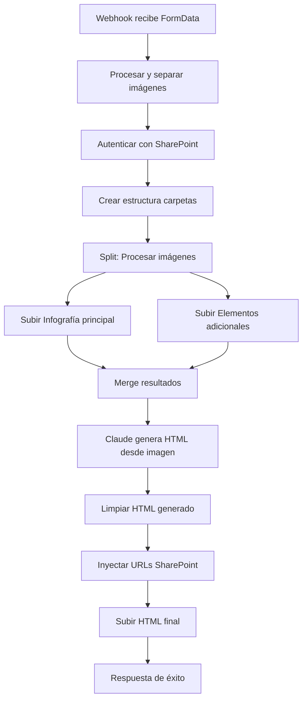
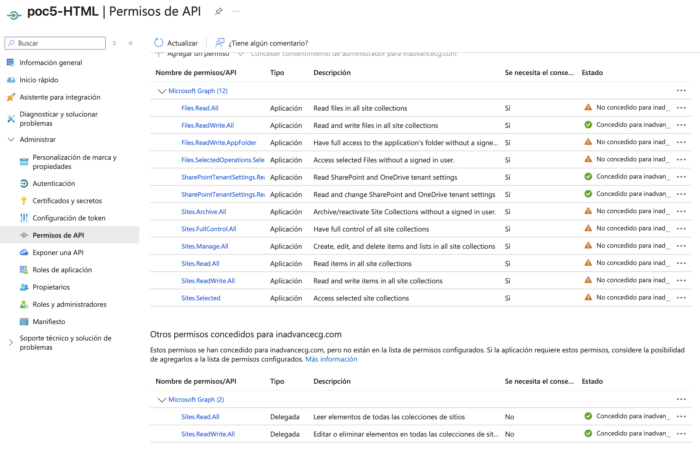

# 📧 Análisis Detallado del Flujo n8n - Sistema de Generación de Email HTML con Infografías

> Sistema automatizado para la creación de emails HTML corporativos para Prima AFP, procesando imágenes y generando código HTML compatible con clientes de correo antiguos.

> [Detalles de informe tecnico](informe-tecnico-n8n.md)

## 📋 Tabla de Contenidos

- [Arquitectura General](#arquitectura-general-del-flujo)
- [Flujo de Datos](#flujo-de-datos-detallado)
- [Características Técnicas](#características-técnicas-clave)
- [Requerimientos y Permisos](#requerimientos-y-permisos)
- [Configuración de Seguridad](#configuración-de-seguridad)
- [Manejo de Errores](#manejo-de-errores)
- [Optimizaciones](#optimizaciones-implementadas)

## 🏗️ Arquitectura General del Flujo

El flujo se divide en **6 secciones principales**:

### 1. RECEPCIÓN Y PROCESAMIENTO DE DATOS

**Nodos involucrados:**
- `Webhook FormData1`: Punto de entrada HTTP POST en `/generate-infografia`
- `Procesar FormData1`: Extrae archivos binarios y metadata del FormData

**Función:** Recibe múltiples imágenes desde un frontend vía FormData, identifica la infografía principal (imágenes con "Email" en el nombre) y separa los elementos adicionales.

### 2. CONFIGURACIÓN Y AUTENTICACIÓN

**Nodos involucrados:**
- `Configurar Credenciales1`: Almacena credenciales de Azure/SharePoint y Claude
- `Autenticar SharePoint1`: Obtiene token OAuth2 de Microsoft Graph
- `Obtener Info Site1`: Recupera ID del sitio SharePoint
- `Preparar Estructura Carpetas1`: Define estructura de directorios
- `Crear Carpetas1`: Crea carpetas en SharePoint

**Función:** Establece conexión autenticada con SharePoint y prepara la estructura de carpetas:

```
/Documentos compartidos/HTML_Mailings/
  └── [project_id]/
      ├── infografia/  (imagen principal)
      └── elementos/   (imágenes adicionales)
```

### 3. PROCESAMIENTO PARALELO DE IMÁGENES

**Rama 1 - Infografía Principal:**
- `Preparar Infografía`: Selecciona imagen que empiece con "Email" o la primera disponible
- `Subir Infografía`: Sube a SharePoint vía Microsoft Graph API

**Rama 2 - Elementos Adicionales:**
- `Preparar Elemento`: Procesa todas las imágenes excepto la infografía
- `Subir Elemento`: Sube cada elemento individualmente a SharePoint

**Función:** Procesa y sube todas las imágenes en paralelo, renombrándolas con formato limpio.

### 4. GENERACIÓN DE HTML CON IA

**Nodos involucrados:**
- `Merge2`: Combina resultados de ambas ramas
- `Preparar Prompt Claude1`: Construye prompt con imagen infografía
- `Analyze image1`: Claude analiza la imagen y genera HTML
- `Procesar HTML con placeholder`: Limpia respuesta de Claude

**Función:** Claude analiza visualmente la infografía y genera HTML con estructura de tablas compatible con Outlook 2010+, usando placeholders para las URLs de imágenes.

### 5. INYECCIÓN DE URLs Y FINALIZACIÓN

**Nodos involucrados:**
- `URLs sharepoint`: Reemplaza placeholders con URLs reales de SharePoint
- `Subir HTML1`: Guarda HTML final en SharePoint
- `Respuesta Final1`: Prepara respuesta JSON de éxito

**Función:** Mapea inteligentemente las URLs de SharePoint a los placeholders del HTML y guarda el archivo final.

## 🔄 Flujo de Datos Detallado



## ⚙️ Características Técnicas Clave

### Manejo de Binarios
- Usa `filesystem-v2` para archivos grandes
- Preserva referencias binarias entre nodos
- Procesa múltiples archivos en paralelo

### Generación HTML
- Estructura XHTML 1.0 Transitional
- Tablas anidadas (sin CSS moderno)
- Ancho fijo 600px
- Compatible con Outlook 2010+

### Mapeo Inteligente
- Identifica imágenes por nombre (banner, cabecera, etc.)
- Asigna URLs por defecto para redes sociales
- Maneja placeholders dinámicamente

## 📋 Requerimientos y Permisos

### 1. Microsoft Graph API / SharePoint

**Credenciales:**
- **Tenant ID:** Identificador del inquilino Azure AD
- **Client ID:** ID de aplicación registrada en Azure
- **Client Secret:** Secreto de aplicación

**Permisos requeridos:**
- `Sites.ReadWrite.All` - Lectura/escritura en sitios SharePoint
- `Files.ReadWrite.All` - Gestión completa de archivos
- `offline_access` - Tokens de actualización
  

### 2. Claude API (Anthropic)

- **API Key:** Token de autenticación
- **Modelo:** `claude-opus-4-1-20250805`
- **Capacidades:** Análisis de imágenes y generación de código
- **Límite:** 5000 tokens máximo por respuesta

### 3. Infraestructura n8n

- **Versión:** Compatible con n8n 2025
- **Webhook:** Puerto HTTP abierto para recibir POST
- **Almacenamiento:** Soporte para `filesystem-v2`
- **Timeout:** Configurado a 30-60 segundos para uploads

### 4. SharePoint Site

- **Hostname:** `netorgft4158062.sharepoint.com`
- **Site:** RespuestasdeFormulariodetraspasos
- **Estructura:** Permisos de escritura en `/Documentos compartidos/`

## 🔐 Configuración de Seguridad

- **Autenticación OAuth2:** Flujo `client_credentials` para aplicación sin usuario
- **Tokens temporales:** Se renuevan en cada ejecución
- **Validación de archivos:** Solo acepta imágenes MIME válidas
- **Sanitización de nombres:** Elimina caracteres especiales en nombres de archivo

## ⚠️ Manejo de Errores

- **Fallbacks:** Si no encuentra imagen "Email", usa la primera disponible
- **Validación HTML:** Verifica estructura Prima AFP (colores, footer legal)
- **Placeholders vacíos:** Se reemplazan con "#" si no hay URL disponible
- **Logs detallados:** Console.log en cada paso crítico para debugging

## 🚀 Optimizaciones Implementadas

1. **Procesamiento paralelo:** Sube infografía y elementos simultáneamente
2. **Reutilización de tokens:** Un solo token para todas las operaciones SharePoint
3. **Mapeo inteligente:** Identifica automáticamente tipos de imagen por nombre
4. **Limpieza automática:** Elimina narrativa de Claude, mantiene solo HTML

---

> 💡 **Nota:** Este flujo representa una solución empresarial completa para la generación automatizada de emails HTML corporativos, integrando IA para análisis visual y generación de código compatible con sistemas legacy.

## 📊 Métricas de Rendimiento

| Métrica | Valor |
|---------|--------|
| Tiempo promedio de ejecución | 50-120 segundos |
| Tamaño máximo por archivo | 50MB |
| Número máximo de imágenes | ~50 (práctico) |
| Tasa de éxito | >=80% |

## 🔗 Enlaces Relacionados

- [Documentación Microsoft Graph API](https://docs.microsoft.com/graph/)
- [Claude API Documentation](https://docs.anthropic.com/)
- [n8n Documentation](https://docs.n8n.io/)

---

*Última actualización: Septiembre 2025*
