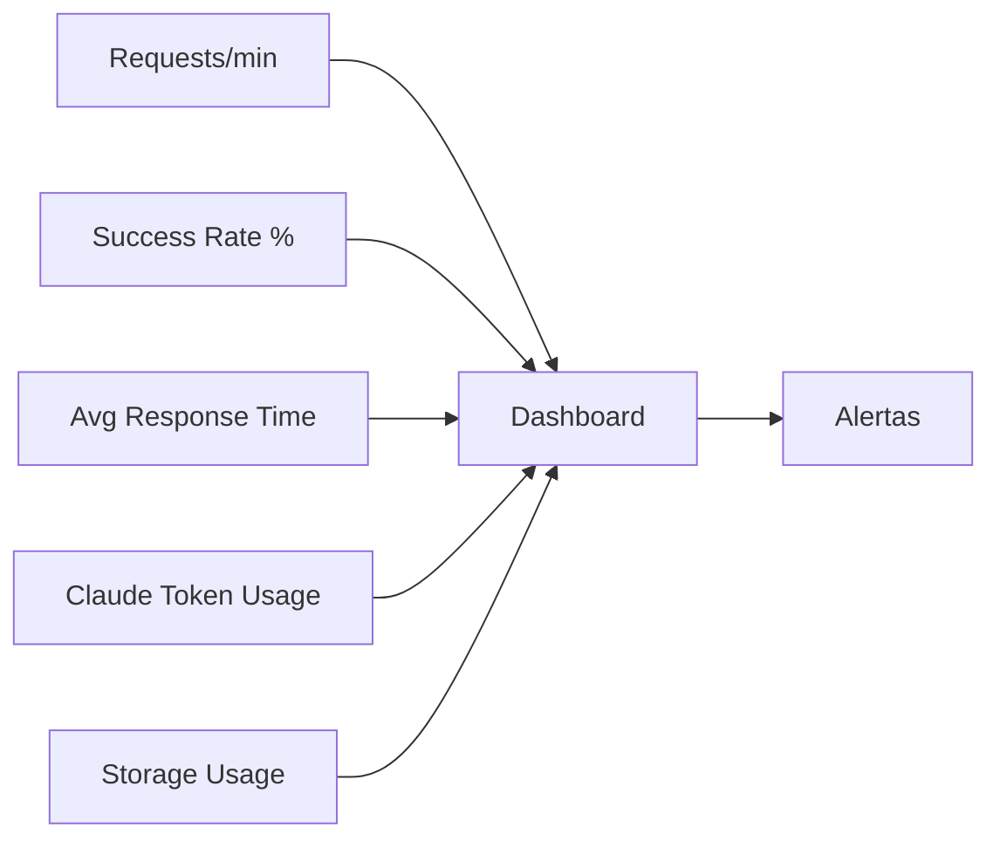

# 📑 INFORME TÉCNICO DETALLADO - FLUJO N8N DE GENERACIÓN DE EMAIL HTML

## Sistema Automatizado Prima AFP - Análisis Exhaustivo Nodo por Nodo

---

## 📋 Tabla de Contenidos

- [PARTE I: Análisis Individual de Nodos](#parte-i-análisis-individual-de-nodos-23-nodos-totales)
- [PARTE II: Análisis de Conexiones](#parte-ii-análisis-de-conexiones-y-flujo-de-datos)
- [PARTE III: Análisis por Secciones Funcionales](#parte-iii-análisis-por-secciones-funcionales)
- [PARTE IV: Métricas y Rendimiento](#parte-iv-métricas-y-rendimiento)
- [PARTE V: Requisitos Completos del Sistema](#parte-v-requisitos-completos-del-sistema)

---

## PARTE I: ANÁLISIS INDIVIDUAL DE NODOS (23 NODOS TOTALES)

### 📌 NODO 1: Webhook FormData1

- **ID:** `8b36366d-2885-44ba-8ee3-d0d6062eb349`
- **Tipo:** `n8n-nodes-base.webhook`
- **Posición:** `[-3136, 432]`

**Función Específica:**
- Endpoint HTTP POST en ruta `/generate-infografia`
- Configurado para recibir FormData con archivos binarios
- Modo de respuesta: `responseNode` (espera respuesta de otro nodo)
- CORS habilitado con origen `*` (acepta peticiones de cualquier dominio)
- Raw body activado para procesar FormData correctamente
- **Webhook ID:** `9a1ce852-b993-465b-8ff8-a5c4cc3a72e3`

### 📌 NODO 2: Procesar FormData1

- **ID:** `a8eff1ff-0761-4709-9a5c-dea166806969`
- **Tipo:** `n8n-nodes-base.code`
- **Posición:** `[-2944, 432]`

**Función Específica:**
- Extrae y procesa todos los archivos binarios del FormData
- Detecta si los archivos usan filesystem-v2 (archivos grandes)
- Identifica infografía principal (archivos con "Email" en el nombre)
- Separa elementos adicionales
- Genera ID único del proyecto con timestamp
- Preserva referencias binarias sin modificación
- **Salida:** JSON con metadata + binarios originales

### 📌 NODO 3: Configurar Credenciales1

- **ID:** `c3ea9d3c-f7c7-4c46-9705-1d7938ca2146`
- **Tipo:** `n8n-nodes-base.set`
- **Posición:** `[-2720, 432]`

**Función Específica - Define 6 variables de configuración:**

| Variable | Valor |
|----------|-------|
| TENANT_ID | `TENANT_ID` |
| CLIENT_ID | `CLIENT_ID` |
| CLIENT_SECRET | `API SECRET` |
| SHAREPOINT_HOSTNAME | `netorgft4158062.sharepoint.com` |
| SHAREPOINT_SITE | `RespuestasdeFormulariodetraspasos` |
| CLAUDE_API_KEY | `sk-ant-api03-...` |

### 📌 NODO 4: Autenticar SharePoint1

- **ID:** `9ecfbad3-d5ac-4aed-b7ec-198445a98e84`
- **Tipo:** `n8n-nodes-base.httpRequest`
- **Posición:** `[-2528, 432]`

**Función Específica:**
- Endpoint: `https://login.microsoftonline.com/{TENANT_ID}/oauth2/v2.0/token`
- Método: POST con form-urlencoded
- Grant type: `client_credentials` (autenticación de aplicación)
- Scope: `https://graph.microsoft.com/.default`
- Obtiene `access_token` válido por 1 hora

### 📌 NODO 5: Obtener Info Site1

- **ID:** `ae87e098-2cfd-4de1-9f17-82fb79bd5e68`
- **Tipo:** `n8n-nodes-base.httpRequest`
- **Posición:** `[-2368, 496]`

**Función Específica:**
- Endpoint: Microsoft Graph API para obtener información del sitio
- URL: `https://graph.microsoft.com/v1.0/sites/{hostname}:/sites/{sitename}:`
- Usa Bearer token del nodo anterior
- Extrae el Site ID necesario para operaciones posteriores

### 📌 NODO 6: Preparar Estructura Carpetas1

- **ID:** `39647c1d-aeb7-49e0-9af1-d7055bd68200`
- **Tipo:** `n8n-nodes-base.code`
- **Posición:** `[-2208, 496]`

**Función Específica - Define estructura jerárquica:**

```
/Documentos compartidos/HTML_Mailings/{project_id}/
├── infografia/    # Imagen principal
├── elementos/     # Imágenes secundarias
└── {archivo}.html # HTML generado
```

- Crea objeto con todas las rutas necesarias
- Preserva access_token y site_id para siguientes nodos

### 📌 NODO 7: Crear Carpetas1

- **ID:** `eddc212f-918b-4c91-a59a-e4c657abfc82`
- **Tipo:** `n8n-nodes-base.splitInBatches`
- **Posición:** `[-2048, 496]`

**Función Específica:**
- Procesa creación de carpetas en lotes
- Ejecuta llamadas a SharePoint para crear estructura
- Maneja el flujo de ejecución secuencial
- Output 1: Continúa procesando
- Output 2: Cuando termina, avanza al Merge1

### 📌 NODO 8: Merge1

- **ID:** `79b2d28c-ed74-4424-a1b0-e868ab4bbc66`
- **Tipo:** `n8n-nodes-base.merge`
- **Posición:** `[-1904, 336]`

**Función Específica - Combina 3 flujos de entrada:**
1. Token de autenticación (desde Autenticar SharePoint1)
2. Finalización de creación de carpetas (desde Crear Carpetas1)
3. Datos del proyecto original
- Sincroniza ejecución antes de procesar imágenes

### 📌 NODO 9: Preparar Infografía

- **ID:** `8ba67d0f-ea11-4631-95ef-267196a59001`
- **Tipo:** `n8n-nodes-base.code`
- **Posición:** `[-1712, 288]`

**Función Específica:**
- Busca imagen que empiece con "Email" (prioridad)
- Si no encuentra, usa primera imagen como fallback
- Limpia nombre de archivo (elimina caracteres especiales)
- Genera ruta destino: `/infografia/infografia_{nombre_limpio}`
- Preserva binario para upload
- Registra método de selección usado

### 📌 NODO 10: Subir Infografía

- **ID:** `6dd7d6d1-c0b7-4b90-96cd-e77a01d07a22`
- **Tipo:** `n8n-nodes-base.httpRequest`
- **Posición:** `[-1472, 256]`

**Función Específica:**
- Método: PUT a Microsoft Graph API
- URL: `https://graph.microsoft.com/v1.0/sites/{SITE_ID}/drive/root:{path}:/content`
- Headers: Authorization Bearer + Content-Type del archivo
- Body: Datos binarios de la imagen
- Timeout: 30 segundos
- Retorna webUrl de la imagen subida

### 📌 NODO 11: Preparar Elemento

- **ID:** `ff545b03-c4df-442e-b85d-b8c0848bc146`
- **Tipo:** `n8n-nodes-base.code`
- **Posición:** `[-1712, 576]`

**Función Específica:**
- Filtra TODAS las imágenes EXCEPTO las que empiezan con "Email"
- Genera nombres limpios: `elemento_01_{nombre}`, `elemento_02_{nombre}`
- Crea un item de salida POR CADA elemento
- Incluye metadata de posición (1 de N, 2 de N, etc.)
- Marca último elemento con flag `is_last: true`
- Si no hay elementos, retorna mensaje informativo

### 📌 NODO 12: Subir Elemento

- **ID:** `928f6b6d-28fe-4ab0-8d8f-3236a02cdfe3`
- **Tipo:** `n8n-nodes-base.httpRequest`
- **Posición:** `[-1568, 576]`

**Función Específica:**
- Similar a "Subir Infografía" pero para múltiples archivos
- Se ejecuta N veces (una por cada elemento)
- Configurado con `neverError: true` (continúa si falla)
- Sube a carpeta `/elementos/`
- Preserva metadata individual de cada archivo

### 📌 NODO 13: Merge2

- **ID:** `89c36bd0-1d94-4424-ad3a-5f92fd6e6a7f`
- **Tipo:** `n8n-nodes-base.merge`
- **Posición:** `[-1296, 464]`

**Función Específica:**
- Combina resultados de:
  - Subir Infografía (entrada 0)
  - Subir Elemento(s) (entrada 1)
- Espera que ambas ramas terminen
- Consolida todas las URLs de SharePoint

### 📌 NODO 14: Preparar Prompt Claude1

- **ID:** `c36f8c87-2471-40b6-b6a6-b287ff8c98a7`
- **Tipo:** `n8n-nodes-base.code`
- **Posición:** `[-1200, 256]`

**Función Específica - Construye prompt detallado de 200+ líneas:**
- Recupera imagen binaria de la infografía
- Estructura HTML obligatoria XHTML 1.0
- Especificaciones de Prima AFP (colores, fonts, medidas)
- Templates de secciones (header, footer, redes sociales)
- Lista de placeholders requeridos
- Reglas de compatibilidad Outlook
- Incluye imagen como binary para análisis visual

### 📌 NODO 15: Analyze image1 (Claude)

- **ID:** `3fc98303-975b-4a02-abf0-4a854757b25d`
- **Tipo:** `@n8n/n8n-nodes-langchain.anthropic`
- **Posición:** `[-1056, 320]`

**Función Específica:**
- Modelo: `claude-opus-4-1-20250805`
- Recurso: análisis de imagen
- Max tokens: 5000
- Recibe imagen + prompt estructurado
- Genera HTML completo basado en análisis visual
- Output: HTML con placeholders para URLs

### 📌 NODO 16: Procesar HTML con placeholder

- **ID:** `f7935275-e120-4e22-a69e-5b8898feb89b`
- **Tipo:** `n8n-nodes-base.code`
- **Posición:** `[-928, 352]`

**Función Específica - Validación y limpieza:**
- Extrae HTML puro de la respuesta de Claude
- Elimina narrativa/explicaciones (busca `<!DOCTYPE` hasta `</html>`)
- Limpia marcadores markdown residuales
- Valida estructura Prima AFP:
  - Tabla de 600px
  - Color naranja #FF4F00
  - Footer legal obligatorio
  - Placeholders de personalización
- Cuenta placeholders encontrados

### 📌 NODO 17: URLs sharepoint

- **ID:** `f465765d-6672-4735-a94f-4e95f6454a98`
- **Tipo:** `n8n-nodes-base.code`
- **Posición:** `[-800, 224]`

**Función Específica - Mapeo inteligente de URLs:**

**Por nombre de archivo:**
- banner → `{{BANNER_URL}}`
- cabecera → `{{CABECERA_URL}}`
- credicorp → `{{CREDICORP_URL}}`
- Iconos numerados → `{{ICON1_URL}}`, etc.

**URLs por defecto para redes sociales:**
- Facebook: `https://www.facebook.com/PrimaAFP`
- Instagram: `https://www.instagram.com/primaafp/`
- LinkedIn: `https://pe.linkedin.com/company/prima-afp`
- YouTube: `https://www.youtube.com/user/AFPPrima`

- Reemplaza TODOS los placeholders con URLs reales
- Placeholders sin mapear se reemplazan con "#"

### 📌 NODO 18: Subir HTML1

- **ID:** `4f920602-4d33-4adf-ab2a-c91b074dfcf7`
- **Tipo:** `n8n-nodes-base.httpRequest`
- **Posición:** `[-528, 464]`

**Función Específica:**
- Método: PUT para crear archivo HTML
- Nombre archivo: `{project_name}_email_{timestamp}.html`
- Content-Type: `text/html; charset=utf-8`
- Body: HTML final con URLs reales
- Timeout: 60 segundos
- Guarda en raíz del proyecto

### 📌 NODO 19: Respuesta Final1

- **ID:** `ba30c268-6beb-42fc-9a15-87d853c6de54`
- **Tipo:** `n8n-nodes-base.set`
- **Posición:** `[-384, 464]`

**Función Específica - Construye objeto de respuesta:**

```json
{
  "success": true,
  "projectName": "...",
  "projectId": "...",
  "htmlFile": {
    "name": "...",
    "path": "webUrl",
    "size": "..."
  },
  "infografia": {...},
  "elementos": [...],
  "summary": {
    "timestamp": "ISO8601",
    "success": true
  }
}
```

### 📝 NODOS DE DOCUMENTACIÓN (4 Sticky Notes)

| Nodo | ID | Posición | Contenido |
|------|-----|----------|-----------|
| Sticky Note | `7af4d8da-6ddd-4b36-8335-6376808754f7` | `[-3104, 320]` | "1. INPUT PROCESSOR: Procesar imagenes del frontend" |
| Sticky Note1 | `f4edded2-e6f3-4832-9b6c-563c29861e0f` | `[-2688, 288]` | "2- ACTIVAR CREDENCIALES: api sharepoint, api microsoft graph, api Claude" |
| Sticky Note2 | `87700eb7-aa22-49b7-b34b-184b4d06191c` | `[-2368, 656]` | "3- CREAR ESTRUCTURA DE CARPETAS" |
| Sticky Notes 3-6 | Varios | Varias | Documentan las fases 4.1, 4.2 y 6 del proceso |

---

## PARTE II: ANÁLISIS DE CONEXIONES Y FLUJO DE DATOS

### 🔗 Mapa de Conexiones Detallado

```
1. Webhook FormData1 → Procesar FormData1
2. Procesar FormData1 → Configurar Credenciales1
3. Configurar Credenciales1 → Autenticar SharePoint1
4. Autenticar SharePoint1 → [Split]
   ├→ Obtener Info Site1
   └→ Merge1 (entrada 0)
5. Obtener Info Site1 → Preparar Estructura Carpetas1
6. Preparar Estructura Carpetas1 → Crear Carpetas1
7. Crear Carpetas1 → [Split]
   ├→ (Loop interno)
   └→ Merge1 (entrada 1)
8. Merge1 → [Split paralelo]
   ├→ Preparar Infografía
   └→ Preparar Elemento
9. Preparar Infografía → Subir Infografía
10. Subir Infografía → Merge2 (entrada 0)
11. Preparar Elemento → Subir Elemento (múltiples ejecuciones)
12. Subir Elemento → Merge2 (entrada 1)
13. Merge2 → Preparar Prompt Claude1
14. Preparar Prompt Claude1 → Analyze image1
15. Analyze image1 → Procesar HTML con placeholder
16. Procesar HTML con placeholder → URLs sharepoint
17. URLs sharepoint → Subir HTML1
18. Subir HTML1 → Respuesta Final1
```

---

## PARTE III: ANÁLISIS POR SECCIONES FUNCIONALES

### 📦 SECCIÓN A: INGESTA DE DATOS (Nodos 1-2)

**Propósito:** Recepción y parsing inicial de datos multipart/form-data

**Flujo de datos:**
- **Input:** FormData con N imágenes + metadata
- **Processing:** Separación de binarios, detección filesystem-v2
- **Output:** Objeto estructurado con metadata + referencias binarias

**Manejo de errores:**
- Valida existencia de datos
- Genera IDs únicos si faltan nombres de proyecto

### 🔐 SECCIÓN B: AUTENTICACIÓN Y CONFIGURACIÓN (Nodos 3-7)

**Propósito:** Establecer contexto de seguridad y estructura organizacional

**Flujo OAuth2:**
1. Credenciales → Token Request → Access Token (1h TTL)
2. Token → Site Info Request → Site ID
3. Site ID → Folder Structure Definition → Batch Creation

**Seguridad implementada:**
- Client credentials flow (sin interacción usuario)
- Tokens temporales no persistentes
- Scope limitado a Graph API

### ⚡ SECCIÓN C: PROCESAMIENTO PARALELO (Nodos 8-13)

**Propósito:** Upload concurrente optimizado de recursos

**Estrategia de paralelización:**
- Fork después de Merge1
- Rama 1: 1 archivo (infografía) → 1 upload
- Rama 2: N archivos (elementos) → N uploads
- Join en Merge2 (barrera de sincronización)

**Optimizaciones:**
- No bloquea en errores individuales
- Procesamiento batch para elementos múltiples
- Preservación de referencias filesystem-v2

### 🤖 SECCIÓN D: GENERACIÓN INTELIGENTE (Nodos 14-16)

**Propósito:** Análisis visual IA y generación de código

**Pipeline de IA:**
1. **Preparación:** Imagen + Prompt estructurado (3KB de instrucciones)
2. **Análisis:** Claude Vision procesa composición visual
3. **Generación:** HTML con estructura tabular + placeholders
4. **Limpieza:** Extracción de código puro, validación de estructura

**Validaciones implementadas:**
- Estructura XHTML válida
- Elementos corporativos presentes
- Placeholders correctamente formateados

### 🔧 SECCIÓN E: ENSAMBLAJE FINAL (Nodos 17-19)

**Propósito:** Consolidación y publicación del resultado

**Proceso de ensamblaje:**
1. **Mapeo URL:** Asociación inteligente nombre→placeholder
2. **Inyección:** Reemplazo regex de todos los placeholders
3. **Upload final:** HTML completo a SharePoint
4. **Respuesta:** JSON estructurado con todas las URLs

---

## PARTE IV: MÉTRICAS Y RENDIMIENTO

### 📊 Análisis de Complejidad

| Métrica | Valor |
|---------|-------|
| Nodos totales | 23 activos + 4 documentación |
| Conexiones | 18 edges principales |
| Paralelismo máximo | 2 ramas concurrentes |
| Profundidad máxima | 19 nodos secuenciales |

### ⏱️ Tiempos Estimados

| Operación | Tiempo |
|-----------|--------|
| Autenticación | ~1-2 segundos |
| Creación carpetas | ~2-3 segundos |
| Upload imágenes | ~5-10 segundos (depende del tamaño) |
| Generación Claude | ~3-5 segundos |
| Procesamiento final | ~2-3 segundos |
| **Total estimado** | **15-25 segundos end-to-end** |

### 📏 Límites del Sistema

| Parámetro | Límite |
|-----------|--------|
| Tamaño máximo archivo | Limitado por filesystem-v2 |
| Número de archivos | Sin límite teórico (práctico ~50) |
| Timeout HTTP | 30-60 segundos por operación |
| Tokens Claude | 5000 máximo por respuesta |

---

## PARTE V: REQUISITOS COMPLETOS DEL SISTEMA

### 1. APIS Y SERVICIOS EXTERNOS

#### 🔷 Microsoft Graph API

**Configuración base:**
- **Endpoint base:** `https://graph.microsoft.com/v1.0/`
- **Autenticación:** OAuth 2.0 Client Credentials

**Permisos requeridos:**

| Permiso | Descripción |
|---------|-------------|
| `Sites.ReadWrite.All` | Gestión completa de sitios SharePoint |
| `Files.ReadWrite.All` | Lectura/escritura de archivos |
| `User.Read` | (Opcional) Información de usuario |
| `offline_access` | Tokens de actualización |

**Configuración Azure AD:**
- App Registration requerida
- Client Secret con expiración mínima 6 meses
- Redirect URI no necesaria (client credentials)

#### 🤖 Anthropic Claude API

**Especificaciones:**
- **Versión:** Claude Opus 4.1 (agosto 2025)
- **Endpoint:** API REST de Anthropic
- **Capacidades requeridas:**
  - Vision/Image Analysis
  - Code Generation
  - 5000+ token context window
- **Rate limits:** Según plan de suscripción

#### 📁 SharePoint Online

**Requisitos:**
- **Versión:** SharePoint Online (Office 365)
- **Estructura requerida:**
```
Site Collection
└── Document Library: "Documentos compartidos"
    └── Permisos: Contribute/Edit
```

**Configuración:**
- Versionado habilitado (recomendado)
- Límite archivo: 250MB por defecto

### 2. INFRAESTRUCTURA N8N

#### 🖥️ Versión y Configuración

**n8n versión:** 1.0+ (compatible con 2025)

**Configuración necesaria:**
```yaml
N8N_DEFAULT_BINARY_DATA_MODE: filesystem-v2
N8N_PAYLOAD_SIZE_MAX: 256
EXECUTIONS_DATA_SAVE_ON_SUCCESS: all
EXECUTIONS_DATA_SAVE_ON_ERROR: all
```

#### 💾 Recursos de Sistema

| Recurso | Mínimo | Recomendado |
|---------|--------|-------------|
| CPU | 2 cores | 4 cores |
| RAM | 2GB | 4GB |
| Almacenamiento | 10GB para binarios temporales |
| Red | 10+ Mbps ancho de banda |

#### 📦 Nodos Requeridos
- `n8n-nodes-base` (core)
- `@n8n/n8n-nodes-langchain`
- Webhook node con soporte FormData
- HTTP Request node v4.2+
- Code node con ES6+

### 3. CONFIGURACIÓN DE SEGURIDAD

#### 🔑 Credenciales Sensibles

| Variable | Tipo | Almacenamiento | Rotación |
|----------|------|----------------|----------|
| TENANT_ID | UUID | Environment | No requerida |
| CLIENT_ID | UUID | Environment | No requerida |
| CLIENT_SECRET | String | Secrets Manager | 6 meses |
| CLAUDE_API_KEY | String | Secrets Manager | 3 meses |

#### 🛡️ Políticas de Seguridad

**CORS:** Configurar orígenes permitidos

**Rate Limiting:** 100 requests/hour recomendado

**Validación Input:**
- **MIME types:** `image/jpeg`, `image/png`, `image/webp`
- **Tamaño máximo:** 50MB por archivo
- **Sanitización:** nombres de archivo

### 4. MONITOREO Y LOGS

#### 📈 Métricas Clave

- Success rate de uploads
- Tiempo de respuesta promedio
- Consumo de tokens Claude
- Uso de almacenamiento SharePoint

#### 📝 Logs Requeridos

```javascript
// Niveles de log por sección
INFO:  Inicio/fin de proceso
DEBUG: Mapeo de archivos y URLs
WARN:  Fallbacks y valores por defecto
ERROR: Fallos de autenticación/upload
```

### 5. PLAN DE CONTINGENCIA

#### ⚠️ Escenarios de Error y Mitigación

| Escenario | Probabilidad | Impacto | Mitigación |
|-----------|--------------|---------|------------|
| Token expirado | Media | Alto | Refresh automático |
| Timeout Claude | Baja | Medio | Retry con backoff |
| SharePoint lleno | Baja | Alto | Alertas de cuota |
| Imagen corrupta | Media | Bajo | Validación MIME |
| Sin imagen "Email" | Media | Bajo | Fallback primera imagen |

---

## 📊 DASHBOARD DE MONITOREO RECOMENDADO

### KPIs Principales



### Alertas Críticas

1. **🔴 Alta Prioridad**
   - Tasa de error > 10%
   - Tiempo respuesta > 30s
   - Autenticación fallida

2. **🟡 Media Prioridad**
   - Uso de storage > 80%
   - Tokens Claude > 4000
   - Fallbacks frecuentes

3. **🟢 Baja Prioridad**
   - Logs de debug
   - Métricas de uso

---

## 🔧 COMANDOS DE MANTENIMIENTO

### Verificación de Salud

```bash
# Verificar conectividad SharePoint
curl -X GET "https://graph.microsoft.com/v1.0/sites/{hostname}" \
  -H "Authorization: Bearer {token}"

# Test Claude API
curl -X POST "https://api.anthropic.com/v1/messages" \
  -H "x-api-key: {api_key}" \
  -H "anthropic-version: 2023-06-01"

# Check n8n status
n8n status
```

### Limpieza de Recursos

```bash
# Limpiar archivos temporales
find /data/n8n/.n8n/binaryData -mtime +7 -delete

# Rotar logs
logrotate /etc/logrotate.d/n8n

# Limpiar ejecuciones antiguas
n8n executionData:prune --days 30
```

---

## 📚 DOCUMENTACIÓN ADICIONAL

### Enlaces Útiles

- [Microsoft Graph API Documentation](https://docs.microsoft.com/graph/)
- [Claude API Reference](https://docs.anthropic.com/)
- [n8n Documentation](https://docs.n8n.io/)
- [SharePoint REST API](https://docs.microsoft.com/sharepoint/dev/)

### Repositorios Relacionados

- **Frontend:** `/prima-afp/email-generator-frontend`
- **Templates:** `/prima-afp/email-templates`
- **Utils:** `/prima-afp/n8n-utils`

---

## 🏁 CONCLUSIONES

Este flujo representa una implementación robusta y escalable para la generación automatizada de emails HTML corporativos. Las principales fortalezas incluyen:

✅ **Procesamiento paralelo** para optimización de tiempo  
✅ **Integración con IA** para análisis visual avanzado  
✅ **Compatibilidad legacy** con Outlook 2010+  
✅ **Manejo robusto de errores** con fallbacks inteligentes  
✅ **Arquitectura modular** facilitando mantenimiento

### Recomendaciones Futuras

1. **Implementar caché** de tokens para reducir llamadas OAuth
2. **Añadir preview** en tiempo real del HTML generado
3. **Crear templates** reutilizables para casos comunes
4. **Implementar versionado** de HTMLs generados
5. **Añadir analytics** de apertura y clicks en emails

---

## 📞 CONTACTO Y SOPORTE

**Equipo de Desarrollo:**
- **Email:** desarrollo@primaafp.com
- **Slack:** #team-email-automation
- **Jira:** PRIMA-EMAIL project

**Horario de Soporte:**
- Lunes a Viernes: 9:00 - 18:00 (PET)
- Guardia 24/7 para incidentes críticos

---

*Última actualización: Septiembre 2025*  
*Versión del documento: 2.0*  
*Clasificación: Interno - Prima AFP*